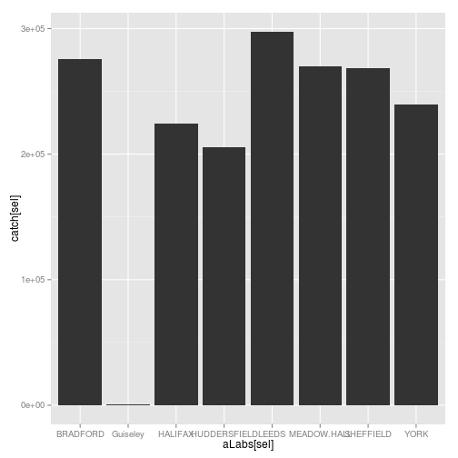
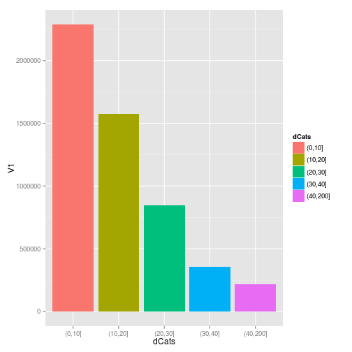
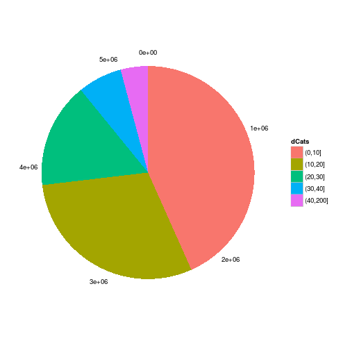

A demand-constrained spatial interaction model in R
========================================================

The aim of this excersise is to demonstrate how a spatial interaction 
model (SIM) can be constructed and analysed in R, a statistical programming language.
The starting point of is a SIM
implemented in Microsoft Excel by Mark Birkin. 
This is a *singly constrained* model, meaning that the flow emanating from each 
zone is known. 25 destinations are modelled as competing for trade from each of 491 zones.
The case study is based on real data from Yorkshire, UK, but could be from anywhere:
the purpose is to show how the SIM works in general terms.

# A brief introduction to SIM

# Loading the data

As with any modelling task based on real world information, the 
starting point, once the theory has been understood and deemed applicable to the problem,
is to load the data. It is crucial that the datasets are loaded correctly in the right 
form, otherwise the model will not work or, worse, may generate meaningless results. 
Specifically, the data must be loaded into R as follows:

 * *Demand* variable, (for each origin) must be vector with length equal to the number of origins.
 * Attractiveness must be a vector equal in length to the number of destinations.
 * A distance matrix must be created, the number of rows and columns of which must be equal to the number of origins and destinations, respectively.
 * $\beta$ (beta) must be set, usually as a single scalar value between 0 and 1 representing the decay in travel between different places as a function of distance (if $\beta$ = 0, distance has no effect).
 
The data is assumed to already have been pre-collected or calculated
and saved as .csv files, except in the case of $\beta$, which we can set manually.
First let us load the demand dataset: 


```r
demand <- read.csv("demand.csv", header = F)
dem <- demand[, 3]  # vector of origins
nrow(dem)
```

```
## NULL
```

```r
summary(dem)
```

```
##    Min. 1st Qu.  Median    Mean 3rd Qu.    Max. 
##    1080    4160   11300   10800   15800   36400
```


The above code loaded in the data, assuming now column titles are present 
in the comma delimited file. The variable corresponding to demand is extracted
using the `[,3]` notation and assigned to a new object `dem`. Checks ensure that 
this vector makes sense: there are 491 values, the mean of which is around 10,000, as expected. 

Next we load in the attractiveness data. This is pre-calculated, usually as a 
function of the size of the destination (e.g. floorspace of shops) and other variables. 
Again, we select only the numeric values corresponding to each of the 25 destinations:


```r
attractiveness <- read.csv("attractiveness.csv")
aLabs <- colnames(attractiveness)[-1]  # save destination names
att <- t(attractiveness[4, -1])  # vector of destinations
nrow(att)
```

```
## [1] 25
```

```r
summary(att)
```

```
##        4        
##  Min.   :  0.3  
##  1st Qu.:100.0  
##  Median :100.0  
##  Mean   : 96.0  
##  3rd Qu.:100.0  
##  Max.   :100.0
```


The largest dataset to load is the distance matrix, with 
rows representing origins and columns destinations and cell values 
the Euclidean distances between them. This file has been pre-prepared 
using GIS analysis and requires no further modification.
It is loaded as a matrix, to allow ease of reference of the cells subsequently:


```r
dis <- as.matrix(read.csv("distance.csv", header = F))
```


Finally we assign the vale of $\beta$.


```r
beta <- 0.1
```


# Checking the dimensions of the datasets

Because of the matrix algebra inherent in SIM procedures, 
it is vital that the dimensions of the relevant objects correspond.
This can be tested quickly and efficiently in R.


```r
nrow(dis) == length(dem)  # should be TRUE
```

```
## [1] TRUE
```

```r
ncol(dis) == length(att)  # should be TRUE
```

```
## [1] TRUE
```


# Running the model

Finally we are ready to run the model. 
Because this is a constrained model, we do not calculate flow directly, 
but via the intermediary stage of balancing factors:


```r
B <- exp(-beta * dis)
B <- sweep(B, MARGIN = 2, STATS = att, FUN = "*")
B[1:3, 1:3]
```

```
##            V1       V2      V3
## [1,]  0.02298 59.68868 0.01943
## [2,] 50.30087  0.05864 0.82979
## [3,] 35.44574  0.02325 2.49755
```


The first line in the above code block assigns B values depending on 
distance, the *distance decay* component of flow. The second line
then multiplies each row (`MARGIN = 2`) by the vector of attractiveness
using the `sweep` function. The third line of code is simple a sanity check to 
view the 9 items from the resulting matrix. Now we are ready to calculate the flow rate.


```r
S <- sweep(B, MARGIN = 1, STATS = dem, FUN = "*")
S <- sweep(S, MARGIN = 1, STATS = rowSums(B), FUN = "/")
S[3, 3]
```

```
##  V3 
## 131
```


Again, sweep is used, first to multiply each column of B values 
by the demand from each zone. Second, the flow is balanced by dividing 
(`FUN = "/"`) by the row sums of the B matrix. The sanity check 
confirms what we were hoping for: the values are the same as with the 
Excel implementation of the model. 

# Analysing the output

Now that we have generated some results, it is time to analyse them.
For starters, which is the most visited destination? 
This can be answered with one line of code:


```r
aLabs[which.max(colSums(S))]
```

```
## [1] "LEEDS"
```

```r
sum(S[, which.max(colSums(S))])
```

```
## [1] 297497
```


The destination modelled to have the highest flow rate is Leeds.
The same technique can be used to identify the least visited destination, and the flow rate there.


```r
aLabs[which.min(colSums(S))]
```

```
## [1] "Guiseley"
```

```r
sum(S[, which.min(colSums(S))])
```

```
## [1] 763.4
```


# Visualising estimated visitor counts

A more complex task is to visualise the relative 
visitor count of a number of different destinations. 
Selecting 8 of the 25 attractions using `grepl`, we can 
plot the output using `ggplot2`:


```r
catch <- colSums(S)
sel <- which(grepl("LEED|YOR|SHEF|BRAD|MEAD|HUDD|HALI|Gu", aLabs))
ggplot() + geom_bar(aes(x = aLabs[sel], y = catch[sel]))
```

```
## Mapping a variable to y and also using stat="bin".  With stat="bin", it
## will attempt to set the y value to the count of cases in each group.  This
## can result in unexpected behavior and will not be allowed in a future
## version of ggplot2.  If you want y to represent counts of cases, use
## stat="bin" and don't map a variable to y.  If you want y to represent
## values in the data, use stat="identity".  See ?geom_bar for examples.
## (Deprecated; last used in version 0.9.2)
```

 


# Frequency of distance bands

More challenging is count the frequency of trips by distance. 
We would expect shorter trips to be far more common (exponentially so)
than longer trips. This important analysis can be conducted by 
dividing all the distance cells into different bins.


```r
dVec <- as.numeric(c(dis))
dBins <- cut(dVec, breaks = c(0, 10, 20, 30, 40, 200))
dCats <- levels(dBins)
dCount <- data.frame(row.names = dCats)
```


In the above code, we first converted the distance matrix into a 1 dimensional vector. 
Then the bins were created using the `cut` command and pre-defined bin breaks. 
Finally, the names of the bins was saved and a new object (`dCount`) was created, 
ready to record the counts supplied by the next command, in a for loop over each of 
the distance bins:


```r
for (i in 1:length(dCats)) {
    dCount[i, 1] <- sum(S[which(dBins == dCats[i])])
}
```


Finally we are ready to plot the results:


```r
dCount
```

```
##               V1
## (0,10]   2288839
## (10,20]  1574626
## (20,30]   845374
## (30,40]   355354
## (40,200]  219539
```

```r
qplot(data = dCount, x = dCats, y = V1, geom = "bar", fill = dCats, stat = "identity")
```

 

```r
p <- qplot(data = dCount, x = (cumsum(V1) + cumsum(c(0, V1[-length(V1)])))/2, 
    y = V1^0, geom = "bar", fill = dCats, stat = "identity", width = V1)

theme_infog <- theme_classic() + theme(axis.line = element_blank(), axis.title = element_blank(), 
    axis.ticks = element_blank(), axis.text.y = element_blank())
p + theme_infog + coord_polar()
```

```
## Warning: position_stack requires constant width: output may be incorrect
```

 


